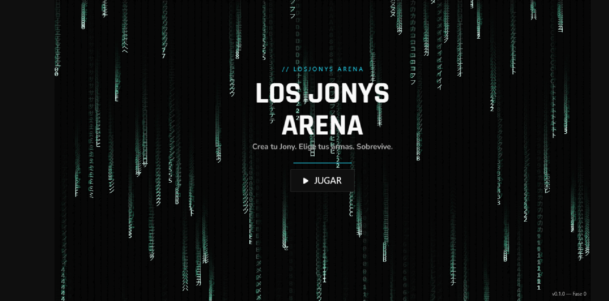
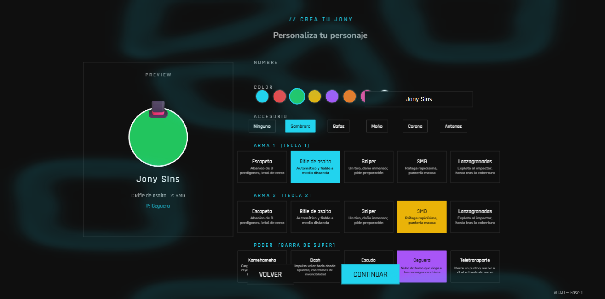
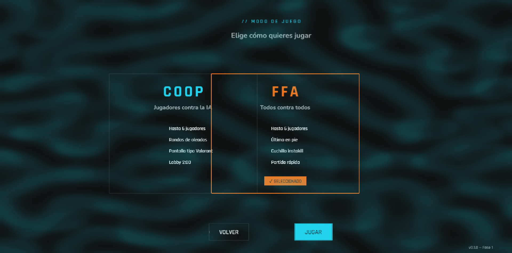
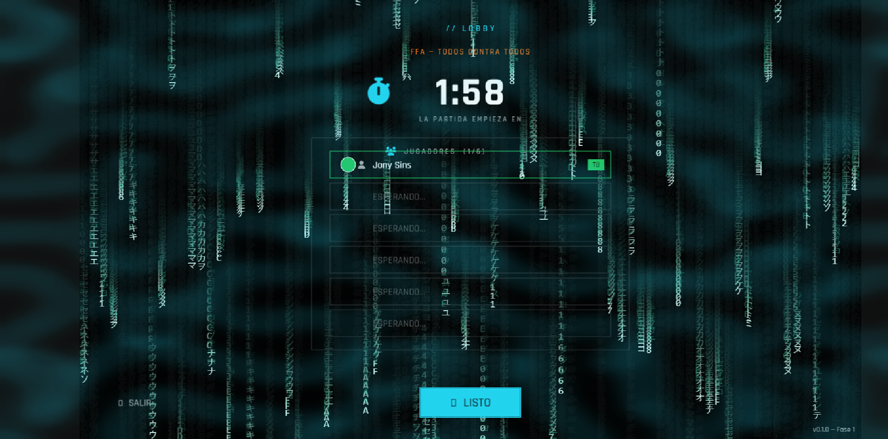
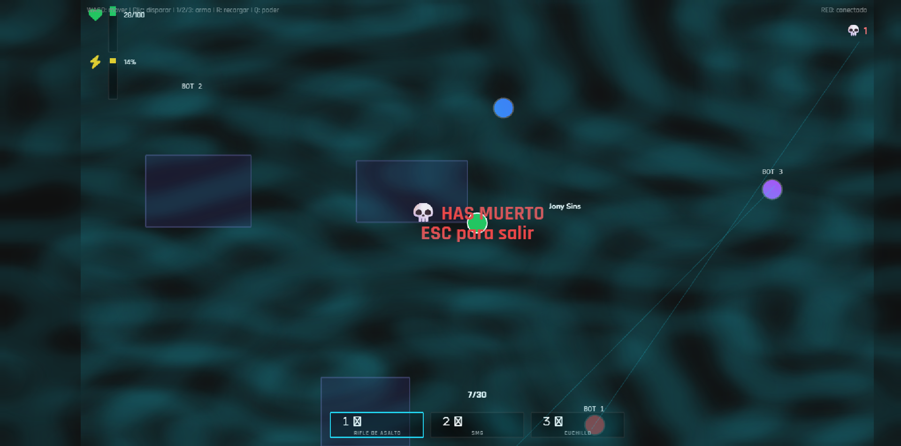
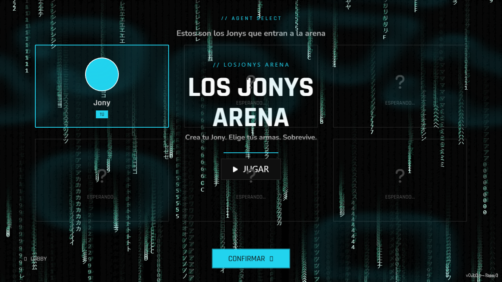

# LosJonys Arena 🎮

**Crea tu Jony. Elige tus armas. Sobrevive a la arena.**

Arena brawler 2D top-down donde creas tu personaje ("Jony") con 2 armas + 1 poder estilo Brawl Stars, y cambio de armas 1/2/3 con cuchillo instakill estilo Valorant. Multiplayer en tiempo real con servidor autoritativo.

> 🏆 Construido en la **IEEE CS Game Jam de la UNIS** (septiembre 2026)

---

## 📸 Screenshots

| Menú principal | Crea tu Jony |
|:---:|:---:|
|  |  |

| Modos de juego | Lobby |
|:---:|:---:|
|  |  |

| Gameplay (vs bots) | Agent Select |
|:---:|:---:|
|  |  |

*Más capturas del desarrollo en [`docs/screenshots/dev/`](docs/screenshots/dev/)*

---

## 🎯 Modos de juego

- **🤝 COOP** (máx 6): lobby 2:00 → pantalla tipo Valorant → oleadas de bots
- **⚔️ FFA** (máx 6): todos contra todos, último en pie

## 🛠️ Stack

| Capa | Tecnología |
|------|-----------|
| Cliente | Phaser 4 + TypeScript + Vite |
| Servidor | Node.js + Colyseus (WebSocket autoritativo) |
| Deploy | Cloudflare Pages (cliente) + Railway/Render (servidor) |

## 🚀 Desarrollo

```bash
# Cliente (juego)
cd client
npm install
npm run dev        # http://localhost:5173

# Servidor (multiplayer)
cd server
npm install
npm run dev        # http://localhost:2567
```

## 📚 Documentación

- `docs/GDD.md` — Game Design Document (diseño completo)
- `AGENTS.md` — Contrato del equipo (Shrek + PUCK)
- `docs/screenshots/` — Capturas del juego y del desarrollo

## 🧑‍🤝‍🧑 Equipo

- **PUCK** — PM, Arquitecto, QA, UI, servidor
- **Shrek** — Gameplay Programmer (armas, poderes, enemigos, IA)

## 📦 Roadmap

- [x] Fase 0: Prototipo local (movimiento + disparo + cuchillo, 2 jugadores red local)
- [x] Fase 1: 5 armas + 5 poderes + game feel
- [x] Fase 2: Modo FFA (sala de 6, zona que se encoge, power-ups)
- [x] Fase 3: Modo COOP (lobby 2:00, agent select, oleadas)
- [ ] Fase 4: Polish + Deploy